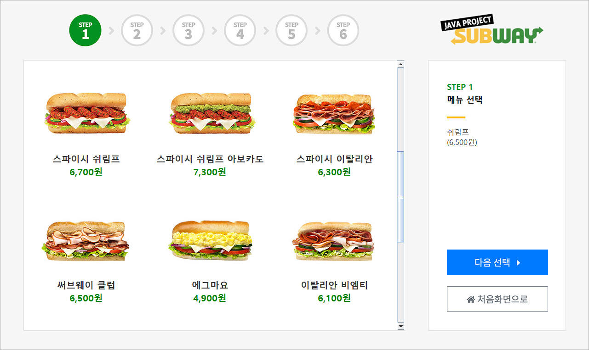
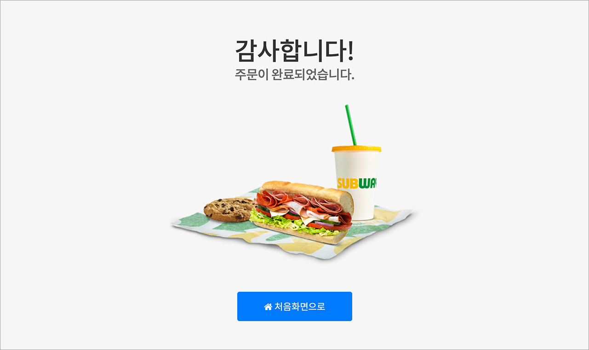
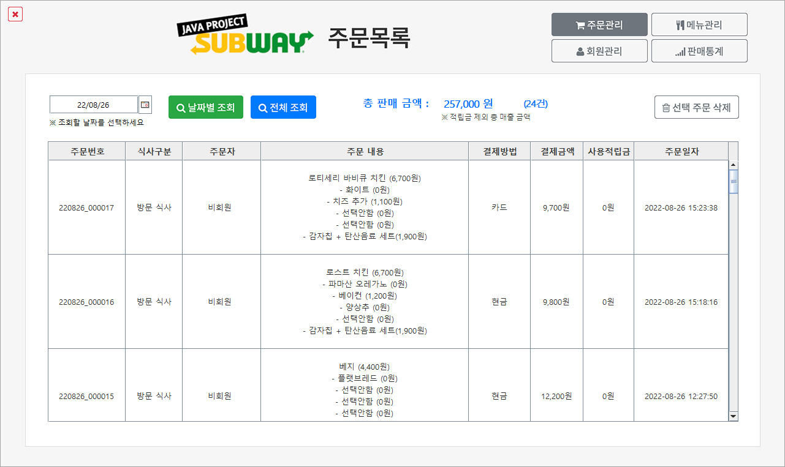
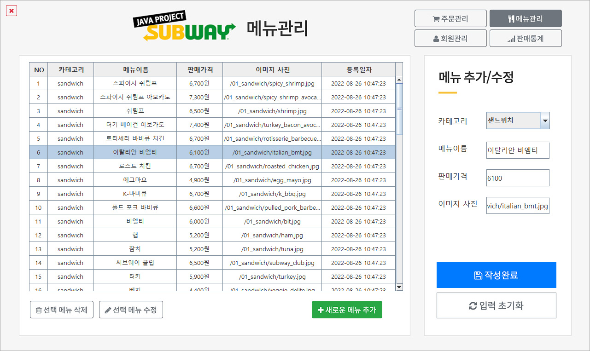

# Subway kiosk Java Swing Project

 

## KH정보교육원 종로 2조
#### 진행기간 : 2022.08.12 ~ 2022.08.29
#### 팀리더 : [남윤지](https://github.com/YJ-NAM)
#### 팀원 : [노동진](https://github.com/ndj111), [공현진](https://github.com/bbbmore), [전영주](https://github.com/Yeongdu), [오현록](https://github.com/ohhyunrok)

 

## Description
현재 "서브웨이"의 오프라인 매장에는 키오스크가 없이 직접 주문 방식으로만 운영되고 있다.
만약 매장에 주문을 하려는 고객이 많을 경우, 선택 할 메뉴(옵션)이 많은 서브웨이 주문 방식으로 인해 생각보다 많은 시간을 기다려야 할 수도 있다.

> 만약에 "서브웨이" 매장에 키오스크 주문 시스템이 있다면 어떨까?

라는 생각에서 직접 만들어 보기로 하였다.
.
.

 

### 실행화면

 
- 비회원 주문하기

- 회원 주문하기
- 회원 가입하기
- 관리자 화면

 

## Environment
> JAVA (jdk-11.0.16.1)
> 
> Oracle Database Express Edition (XE) Release 11.2.0.2.0
>
> JDBC
> 
> jCalendar 1.4

 

## Files
`/main/Main_UI.java` 통합 실행 파일

`/model/AddCartDTO.java` 주문 넣기를 위한 모델 파일

`/model/MenuSelectDTO` 주문 메뉴 선택을 위한 모델 파일

`/images/` 사용 이미지 폴더 

 

## Work

- 노동진 : 사용자 주문화면, 주문입력, 파일 취합

- 남윤진 : 판매 통계
- 공현진 : 주문내역
- 전영주 : 사용자 로그인, 사용자 회원가입, 회원관리
- 오현록 : 메뉴관리
